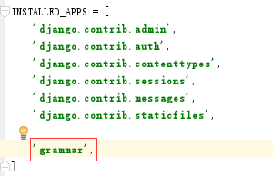
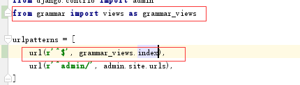
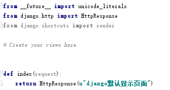
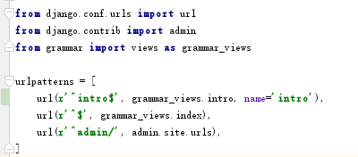
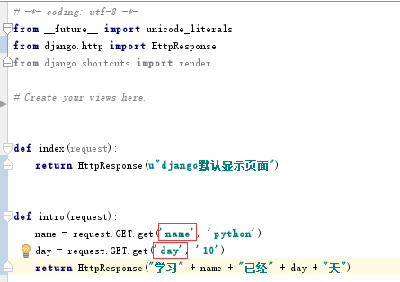
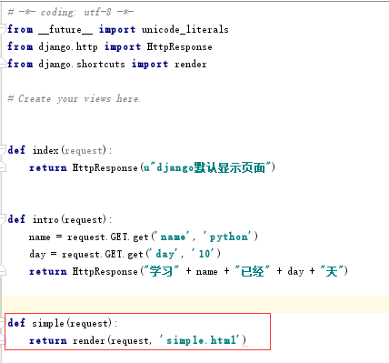
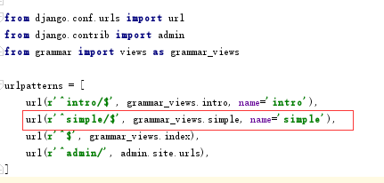
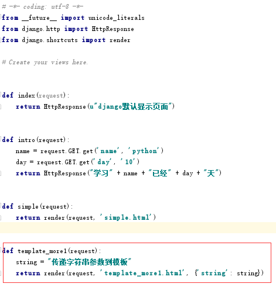
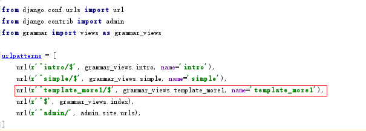
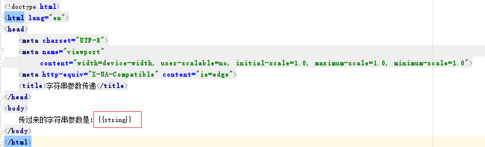

# python 的相关使用

* [相关指令](#相关指令)
    * [项目创建](#项目创建)
    * [app创建](#app创建)
    * [创建和更新数据库](#创建和更新数据库)
    * [使用开发服务器](#使用开发服务器)
* [项目的基本结构](#项目的基本结构)
* [视图和网址](#视图和网址)
    * [基本的网址](#基本的网址)
    * [含参数的网址](#含参数的网址)
* [模板](#模板)
    * [模板的更多使用](#模板的更多使用)
        * [字符串参数传递](#字符串参数传递)
* [相关地址](#相关地址)

## 相关指令
常用的指令有，创建项目，新建app，创建数据库表，更改数据库表字段，使用开发服务器，清空数据库，创建超级管理员，django项目环境终端

#### 项目创建
例如创建本项目（名称为learn_grammars）
```
django-admin startproject learn_grammars
```

#### app创建
例如创建app（名称为grammar）
```
python manage.py startapp grammar
```

#### 创建和更新数据库
```
# 1. 创建更改的文件
python manage.py makemigrations
# 2. 将生成的py文件应用到数据库
python manage.py migrate
```

#### 使用开发服务器
代码调试中使用开发服务器，指令为：
```
python manage.py runserver 8001
```
默认端口号时8000  
如果端口号被占用了，可以使用kill关闭和lsof查询

## 项目的基本结构
创建项目后，会自动形成一个和项目名相同的文件夹。文件夹下的文件有：
_init_.py    python包目录必须文件，无需理会
settings.py  项目的相关设置，例如：数据库，log等
urls.py      项目的请求地址配置文件
wsgi.py      部署服务器时需要用到

创建新的app后，首先需要在settings.py中进行配置
将app名称添加到settings.py中的INSTALL_APPS中
```
INSTALLED_APPS = [
    'django.contrib.admin',
    'django.contrib.auth',
    'django.contrib.contenttypes',
    'django.contrib.sessions',
    'django.contrib.messages',
    'django.contrib.staticfiles',

    'grammar',
]
```
  
新建的 app 如果不加到 INSTALL_APPS 中的话, django 就不能自动找到app中的模板文件(app-name/templates/下的文件)和静态文件(app-name/static/中的文件) 

## 视图和网址
需要在urls.py中添加访问路径和访问对应的页面
```
from django.conf.urls import url
from django.contrib import admin
from grammar import views as grammar_views

urlpatterns = [
    url(r'^$', grammar_views.index),
    url(r'^admin/', admin.site.urls),
]
```
```
# -*- coding: utf-8 -*-
from __future__ import unicode_literals
from django.http import HttpResponse
from django.shortcuts import render

# Create your views here.


def index(request):
    return HttpResponse(u"django默认显示页面")
```
  
  
这个是最简单的配置网址，没有参数，全部通配  

#### 含参数的网址
```
from django.conf.urls import url
from django.contrib import admin
from grammar import views as grammar_views

urlpatterns = [
    url(r'^intro$', grammar_views.intro, name='intro'),
    url(r'^$', grammar_views.index),
    url(r'^admin/', admin.site.urls),
]
```
```
# -*- coding: utf-8 -*-
from __future__ import unicode_literals
from django.http import HttpResponse
from django.shortcuts import render

# Create your views here.


def index(request):
    return HttpResponse(u"django默认显示页面")


def intro(request):
    name = request.GET.get('name', 'python')
    day = request.GET.get('day', '10')
    return HttpResponse("学习" + name + "已经" + day + "天")
```
  
  
其中name='intro'相当于别名  
上面的需要传参数name和day

## 模板
views.py中需要改动
```
def simple(request):
    return render(request, 'simple.html')
```
在app下添加templates文件夹，然后再下面添加html文件
urls.py中添加地址
```
url(r'^simple/$', grammar_views.simple, name='simple'),
```
  
  

#### 模板的更多使用
模板中可以进行下面的相关使用：
1. 列表，字典，类的使用
2. 循环：迭代显示列表，字典等内容
3. 条件判断：判断是否显示该内容，比如判断手机访问，还是电脑访问，给出不一样的代码
4. 标签：for，if等功能
5. 过滤器：管道符号后面的功能，比如{{var|length}},求变量长度length就是一个过滤器

###### 字符串参数传递
views.py中需要改动
```
def template_more1(request):
    string = "传递字符串参数到模板"
    return render(request, 'template_more1.html', {'string': string})
```
urls.py中需要改动
```
url(r'^template_more1/$', grammar_views.template_more1, name='template_more1'),
```
template_more1.html中接收参数
```
{{string}}
```
  



## 相关地址
[https://code.ziqiangxuetang.com/django/django-tutorial.html](https://code.ziqiangxuetang.com/django/django-tutorial.html)